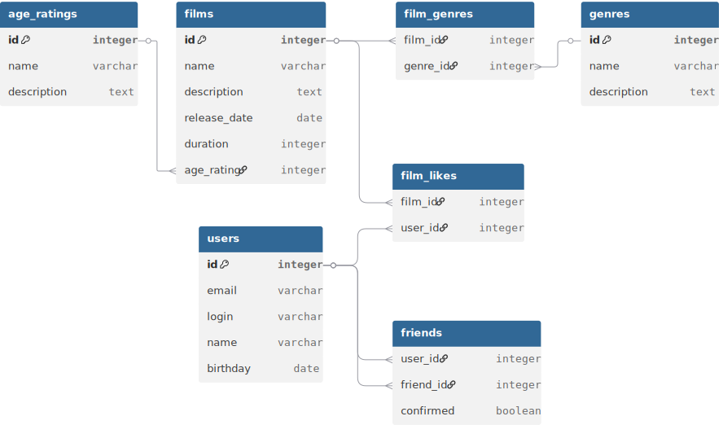

# java-filmorate
*Схема базы данных*


## Описание Базы Данных (БД)
#### users
Содержит основную информацию о пользователях. Здесь:
* **id** - айди пользователя *(ключевой атрибут)*;
* **email** - электронная почта;
* **login** - логин пользователя;
* **name** - имя пользователя;
* **birthday** - дата рождения пользователя ('гггг-мм-дд').

Взаимосвязь с другими таблицами:
* *friends*:
  * users.id = friends.user_id,
  * users.id = friends.friend_id;
* *film_likes*:
  * users.id = film_likes.user_id.

---

#### friends
Содержит информацию о наличии и статусе дружбы между пользователями. Здесь:
* **user_id** - айди пользователя 1;
* **friend_id** - айди пользователя 2;
* **confirmed** - статус связи (подтвержденная/неподтвержденная).

Взаимосвязь с другими таблицами:
* *users*:
  * friends.user_id = users.id,
  * friends.friend_id = users.id.

---

#### films
Содержит основную информацию о фильмах. Здесь:
* **id** - айди фильма *(ключевой атрибут)*;
* **name** - название фильма;
* **description** - описание фильма;
* **release_date** - дата релиза ('гггг-мм-дд');
* **duration** - длительность фильма (мин);
* **age_rating** - возрастной рейтинг по МРА.

Взаимосвязь с другими таблицами:
* *film_likes*:
  * films.id = film_likes.film_id;
* *film_genres*:
  * films.id = film_genres.film_id;
* *age_ratings*:
  * films.age_rating = age_ratings.id.

---

#### film_likes
Содержит информацию о лайках, поставленных пользователями фильмам. Здесь:
* **film_id** - айди фильма;
* **user_id** - айди пользователя.

Взаимосвязь с другими таблицами:
* *films*:
  * film_likes.film_id = films.id;
* *users*:
  * film_likes.user_id = users.id.

---

#### film_genres
Содержит информацию о жанрах конкретных фильмов. Здесь:
* **film_id** - айди фильма;
* **genre_id** - айди жанра.

Взаимосвязь с другими таблицами:
* *films*:
  * film_genres.film_id = films.id;
* *genres*:
  * film_genres.genre_id = genres.id.

---

#### genres
Содержит информацию о жанрах. Здесь:
* **id** - айди жанра *(ключевой компонент)*;
* **name** - название жанра;
* **description** - описание жанра.

Взаимосвязь с другими таблицами:
* *film_genres*:
  * genres.id = film_genres.genre_id.

---

#### age_ratings
Содержит информацию о возрастных рейтингах по МРА. Здесь:
* **id** - айди категории *(ключевой компонент)*;
* **name** - обозначение категории по МРА;
* **description** - описание категории.

Взаимосвязь с другими таблицами:
* *films*:
  * age_ratings.id = films.age_rating.
---

### Примеры запроса к БД
Получить список всех пользователей:
```
SELECT *
FROM users;
```
Найти пользователя с айди 0:
```
SELECT *
FROM users
WHERE id = 0;
```
Получить список друзей пользователя с айди 0:
```
SELECT *
FROM users
WHERE id IN (SELECT friend_id
    FROM friends
    WHERE user_id = 0);
```
Получить список общих друзей для пользователей с айди 0 и 1:
```
SELECT *
FROM users
WHERE id IN (SELECT friend_id
        FROM friends
        WHERE user_id = 0
        UNION SELECT user_id
        FROM friends
        WHERE friend_id = 0)
    AND id IN (SELECT friend_id
        FROM friends
        WHERE user_id = 1
        UNION SELECT user_id
        FROM friends
        WHERE friend_id = 1);
```
Получить список фильмов:
```
SELECT f.name,
    ar.name category,
    f.release_date,
    f.duration
FROM films f
LEFT JOIN age_ratings ar ON f.age_rating = ar.id;
```
Найти фильм с айди 0:
```
SELECT f.name,
    ar.name category,
    f.release_date,
    f.decription,
    f.duration
FROM films f
LEFT JOIN age_ratings ar ON f.age_rating = ar.id
WHERE id = 0;
```
Получить топ-10 фильмов:
```
SELECT f.name,
    f.release_date,
    COUNT(fl.user_id)
FROM films f
LEFT JOIN film_likes fl ON f.id = fl.film_id
GROUP BY f.name
ORDER BY COUNT(fl.user_id) DESC
LIMIT 10;
```
